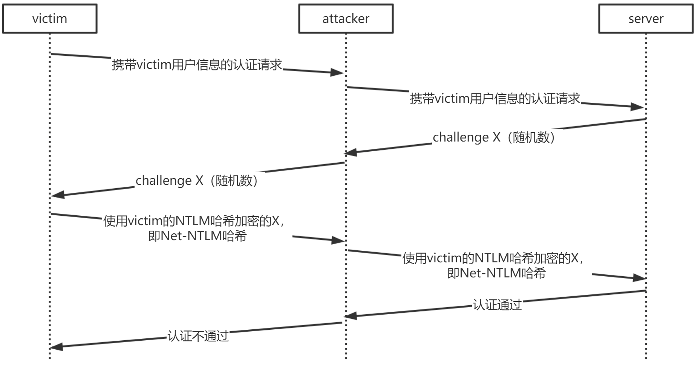
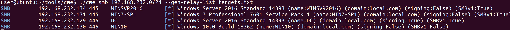
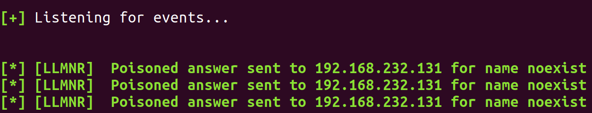
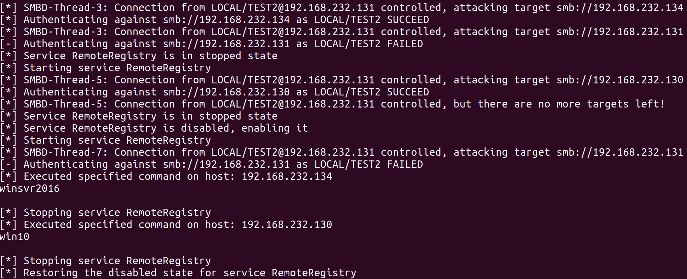

## NTLM Relay 攻击原理

NTLM relay攻击本质上是针对NTLM认证协议的中间人攻击，利用此攻击，攻击者可以在域内网络环境下， 伪装成认证过程中的server端并实行中间人攻击。

NTLM认证协议可以参考之前的[文章](https://blog.usec.cc/posts/security/domain/pass-the-hash/)，NTLM relay的流程如下图所示：



可以看出，攻击者为了响应server的challenge、完成认证过程，不必真正拥有victim的NTLM哈希，只需将此challenge发送给victim，由victim使用自己的NTLM哈希计算得出Net-NTLM哈希之后，attacker转发给server，则server认为attacker确实为其所声明的victim用户。

这是一个典型的对于认证协议的中间人攻击，其中的关键是NTLM认证协议中并没有对server认证的部分，导致attacker可以伪装成server，与victim交互并获取victim提供的信息。

## NTLM Relay 利用方式

缓解此攻击的主要方式为启用SMB signing，这将导致attacker即使中继攻击认证成功，也无法与目标server进行后续的交互。针对SMB协议的NTLM中继攻击只能对没有开启SMB signing的机器发起。

默认情况下，domain controller会强制进行SMB signing，此选项由注册表项中的`HKEY_LOCAL_MACHINE\SYSTEM\CurrentControlSet\Services\LanmanWorkstation\Parameters\RequireSecuritySignature`控制，当其值为1时，则必须进行SMB signing。

若满足攻击条件，要实现上述NTLM Relay攻击的流程，有以下两个前提：

- attacker需要预先知晓Relay的目标server
- victim要主动对attacker发起认证请求

攻击者需要预先搜集网络内没有开启SMB signing的机器，作为中继攻击的目标，可以利用[CrackMapExec](https://github.com/byt3bl33d3r/CrackMapExec)或者[Responder](https://github.com/lgandx/Responder) tools中的`RunFinger.py`来搜集网络中没有开启SMB signing的机器。

为使victim向attacker发起认证请求，可以利用SSRF、XXE等手段使目标向attacker发送认证请求，此外，Responder工具可以使用多种方式诱骗机器向自身发起NTLM认证，如监听利用LLMNR请求，将attacker自身的地址作为LLMNR的响应地址。（当Windows机器无法利用DNS解析名称时，会使用LLMNR协议进行广播请求来试图获取名称地址。）

Responder还可以直接完成NTLM认证的流程并抓取Net-NTLM哈希，该哈希可以被用来进行用户密码破解。而NTLM中继的攻击流程则要利用Responder tools中的`MultRelay.py`或者[Impacket](https://github.com/SecureAuthCorp/impacket)中的`ntlmrelayx.py`，它们监听445与80端口、取代Responder完成NTLM的认证过程，所以需要同时关闭Responder配置中的SMB server和HTTP server，此时Respnder的作用为响应LLMNR请求以将victim的请求导向attacker。

为了能够在目标机器上执行命令，发起认证的victim账户需要具有目标机器的本地管理员权限。

需要注意的是，SMB有三个版本，其中SMBv1版本历史悠久并存在诸多漏洞（如永恒之蓝等），所以在win10系统中SMBv1默认未被启用，而Responder中的`MultiRelay.py`仅支持SMBv1，是无法攻击默认未开启SMBv1的win10机器的，Impacket中的`ntlmrelayx.py`可以通过`-smb2support`选项来支持SMBv2，所以能够攻击win10。此外，`MultiRelay.py`则只能指定一个中继目标IP，而`ntlmrelayx.py`可以同时指定多个ip作为中继目标，但前者在利用成功时可以直接获得shell。

## NTLM Relay 实际测试

测试环境为域环境，相关机器说明如下：

- Victim：发起NTLM认证的机器，所登录账户为域账户local\test2，系统为Windows 7 SP1，IP地址为192.168.232.131；
- Attacker：攻击机器，与Victim在同一网络链路内，系统为Ubuntu 18.04，IP地址为192.168.232.132；
- Server：两台目标机器，操作系统分别为Win 10、Windows Server 2016，IP地址分别为192.168.232.130、192.168.232.134，两台机器的本地管理员都包含local\test2账户。

具体的攻击流程如下。在Attacker机器中：

- 使用cme搜集未开启SMB signing的机器：

```bash
cme smb 192.168.232.0/24 --gen-relay-list targets.txt
```



可以看到除了域控外，SMB signing均为False，另外Win10机器不支持SMBv1。

- 启动Responder，`-I`指定接口网卡名：

```bash
./Responder -I ens37 -rv
```

- 启动ntlmrelayx，`-c`用来指定执行的命令：

```bash
./ntlmrelayx.py -tf targets.txt -c hostname -smb2support
```

在作为Victim的Win7机器中执行会触发NTLM认证的命令：


去访问一个并不存在的名称，在DNS解析失败后，机器试图利用LLMNR协议解析名称，则Responder对此请求进行响应，响应地址设置为Attacker的地址。



随后ntlmrelayx.py收到NTLM认证请求，可以看到进行了多次中继攻击，对于win10与Windows Server2016的攻击成功并返回命令执行结果。



因为Victim同样未开启SMB signing，所以被cme搜集进了targets.txt，在输出中可以看到中继回Victim本身的认证并未成功，这种中继回本身的攻击一般称之为`Reflection attack`，这种攻击成功率相对来说更高，因为来自本机的用户更有可能具有该机器的管理员权限。但微软于MS08-068中修复了它，所以NTLM Relay攻击不能中继到Victim本身。

## 延申

微软通过MS08-068等补丁修复NTLM relay的`Reflection attack`的方式为，在系统发起NTLM认证、利用challenge计算Net-NTLM hash时，会将challenge缓存，而后续在NTLM认证的过程中作为server端检验Net-NTLM hash的值时，会检查对应的challenge在缓存中是否已经存在，如果存在则拒绝认证。

但是在[CVE-2019-1384](https://shenaniganslabs.io/2019/11/12/Ghost-Potato.html)中指出，challenge的值的缓存是存在5分钟时效的，在challenge缓存过期后，过期的challenge被触发清除的时机为进行NTLM认证，而经过测试，NTLM认证是可以中途挂起5分钟之后继续进行的。这样就绕过了challenge的缓存检测，从而能够进行反射攻击。

---

参考资料：

[SMB Relay Demystified and NTLMv2 Pwnage with Python](https://www.sans.org/blog/smb-relay-demystified-and-ntlmv2-pwnage-with-python/)

[Practical guide to NTLM Relaying in 2017 (A.K.A getting a foothold in under 5 minutes)](https://byt3bl33d3r.github.io/practical-guide-to-ntlm-relaying-in-2017-aka-getting-a-foothold-in-under-5-minutes.html)